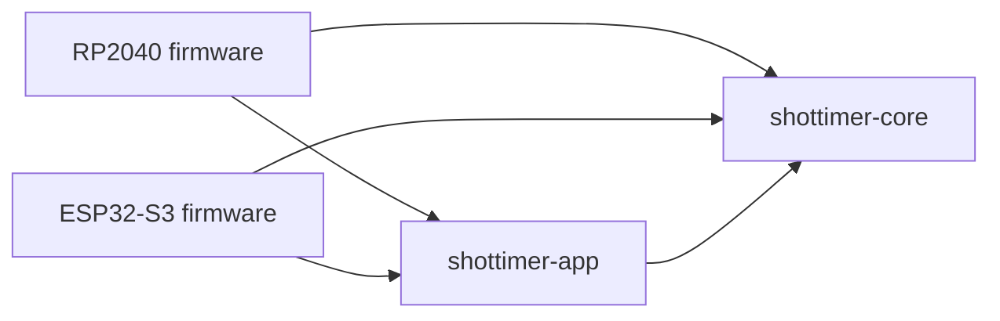

<!-- markdownlint-disable MD033 -->
<h1 align="center">shottimer</h1>

<p align="center">
  <strong>An automatic espresso shot timer that starts when your machine does.</strong><br>
  Vibration-triggered Rust firmware for round Waveshare RP2040 and ESP32-S3
  boards. No buttons, wires, or plumbing modifications.
</p>

<p align="center">
  <a href="#-what-it-does">What it does</a>
  &nbsp;·&nbsp;
  <a href="#-how-it-works">How it works</a>
  &nbsp;·&nbsp;
  <a href="#-housing">Housing</a>
  &nbsp;·&nbsp;
  <a href="#-build-and-flash">Build &amp; flash</a>
</p>

<p align="center">
  <a href="https://github.com/michidk/shottimer/actions/workflows/firmware.yml"></a>
  <a href="https://github.com/michidk/shottimer/actions/workflows/housing.yml"></a>
  <a href="https://www.rust-lang.org/"></a>
  <a href="#-license"></a>
</p>

<p align="center">
  
</p>

---

No button press, plumbing modification, or connection to the espresso machine is
required. Place the timer on the machine, pull a shot, and its QMI8658 motion
sensor detects the pump vibration automatically.

## ☕ What it does

- Automatic shot timing from machine vibration, with no button press required.
- Circular progress display and history of the three previous shots.
- Configurable vibration sensitivity, display, battery and sleep settings.
- Motion gesture to switch between the timer and diagnostic display.
- Shared Rust firmware for RP2040 and ESP32-S3 boards.
- Parametric, 3D-printable desktop and magnetic housings for the RP2040 board.

## 🧰 Hardware support

| Board | Firmware | Display | Motion sensor | Status |
| --- | --- | --- | --- | --- |
| Waveshare RP2040-LCD-1.28 | `firmware-rp2040` | GC9A01, 240×240 | QMI8658 | Hardware-tested |
| Waveshare ESP32-S3-Touch-LCD-1.28 | `firmware-esp32s3` | GC9A01, 240×240 | QMI8658 | Builds; hardware testing pending |

Touch, Wi-Fi, Bluetooth, and PSRAM on the ESP32-S3 board are not used yet.

## 🏠 Housing

Two printable, screw-free housings are available for the RP2040-LCD-1.28 board
and a MakerFocus 2000 mAh battery: a desktop stand and a magnetic version for
mounting directly to the machine.

<p align="center">
  
</p>

**View on [GitHub](https://github.com/michidk/shottimer/tree/main/housing)
or [MakerWorld](https://makerworld.com/en/models/3389507-shottimer).**

[Dimensions, assembly, and parametric CAD](housing/README.md)

## 🧱 Architecture

- `crates/shottimer-core`: timing, motion/orientation, battery estimation, settings.
- `crates/shottimer-app`: shared firmware loop, UI, display and IMU drivers.
- `crates/firmware-rp2040`: RP2040 board backend.
- `crates/firmware-esp32s3`: ESP32-S3 board backend.

Both boards run the same application through embedded-hal drivers and a small
`Platform` interface that separates shared behavior from board-specific hardware.
Dependencies flow from firmware → app → core; firmware can also use core directly.
Shared crates must not depend on MCU HALs.



## 🔄 How it works

After the three-second RGB display test, keep the display still and face-up during
boot calibration. The default configuration then starts in Timer mode.

- Detects vibration from the largest per-axis standard deviation across ten
  acceleration samples taken at 10 ms intervals.
- Starts a shot after two seconds of continued vibration and counts in calibrated
  975 ms increments, resetting at 99 displayed seconds.
- Stops after a quiet timer bucket and corrects the result to the last detected
  vibration, excluding the stop-confirmation delay. Shots shorter than five
  seconds are discarded.
- Retains valid results for 60 seconds. Three seconds of continued vibration
  replaces a retained result; the new timer first appears at `3`.
- Shows three previous valid shot times, newest first, excluding the current
  result. History survives resets, mode switches, and sleep, but clears on reboot.

The progress arc fills in two brown shades over two 25-second laps, remaining
full after 50 seconds while the number continues.

Hold the LCD face-down for 0.5 seconds, then turn it face-up to toggle Timer and
Debug modes. Orientation filtering adds some response time; switching resets
the active timer. Set `DEBUG_MODE_ENABLED = false` to disable Debug mode and
this gesture.

## 🐛 Debug mode

Debug mode shows IMU address/errors, acceleration mean and standard deviation,
filtered orientation, vibration threshold and rolling peak, timer/idle state,
and battery voltage, estimated charge, ADC value, and trend.

Both boards log acceleration and orientation twice per second: RP2040 through
USB CDC, ESP32-S3 through its CH343 UART bridge at 115200 baud. Logging and its
interval are configurable; disabling logs leaves the serial interface available.

## ⚙️ Configuration

See [config.md](config.md) for compile-time settings, vibration tuning, sleep,
battery and display options, and hardware assignments. Changes require rebuilding
and flashing the firmware.

## 🚀 Build and flash

Install [rustup](https://rustup.rs) and use its Cargo/Rust binaries (put
`~/.cargo/bin` before any system Rust in `PATH`). Rustup installs the pinned
toolchain, components and RP2040 target from `rust-toolchain.toml`. Host checks
require no board:

```sh
cargo fmt --all -- --check
cargo test --locked
cargo clippy --locked --all-targets -- -D warnings
```

### RP2040

```sh
rustup target add thumbv6m-none-eabi
cargo install elf2uf2-rs
cargo rp2040
```

Hold **BOOT** while connecting USB, then flash:

```sh
cargo run --release -p firmware-rp2040 --target thumbv6m-none-eabi
```

ELF: `target/thumbv6m-none-eabi/release/shottimer-rp2040`.
The target runner converts it to UF2 and copies it to the BOOTSEL drive.

### ESP32-S3

Install the [Espressif Rust toolchain](https://docs.espressif.com/projects/rust/book/getting-started/toolchain.html):

```sh
cargo install espup espflash
espup install --targets esp32s3
. ~/export-esp.sh
cargo +esp esp32s3
```

Source the export script in each shell; if a custom export path was used, source
that instead. The `esp` toolchain and `-Zbuild-std=core` are required for Xtensa.

Connect the board over USB and flash via its CH343 serial bridge:

```sh
cargo +esp run --release -p firmware-esp32s3 \
  --target xtensa-esp32s3-none-elf -Zbuild-std=core
```

ELF: `target/xtensa-esp32s3-none-elf/release/shottimer-esp32s3`.
The runner uses `espflash` with ESP32-S3, 16 MB flash, and serial monitoring.
If automatic download fails, hold **BOOT**, press **RESET**, and retry.
Do not flash an RP2040 UF2 onto ESP32-S3.

## 🙏 Acknowledgements

Shot detection and the circular timer concept were inspired by
[`lspr98/profitec-go-waterlevel-shottimer`](https://github.com/lspr98/profitec-go-waterlevel-shottimer).
This is an independent Rust implementation and contains none of that project's
source code. The referenced repository did not declare a software license when
this acknowledgement was written.

## 📄 License

This project is available under either the [Apache License 2.0](LICENSE-APACHE)
or [MIT License](LICENSE-MIT).

---

<p align="center">
  Built for espresso machines that know when the shot begins.<br>
  <sub><a href="https://github.com/michidk/shottimer">View on GitHub</a></sub>
</p>
