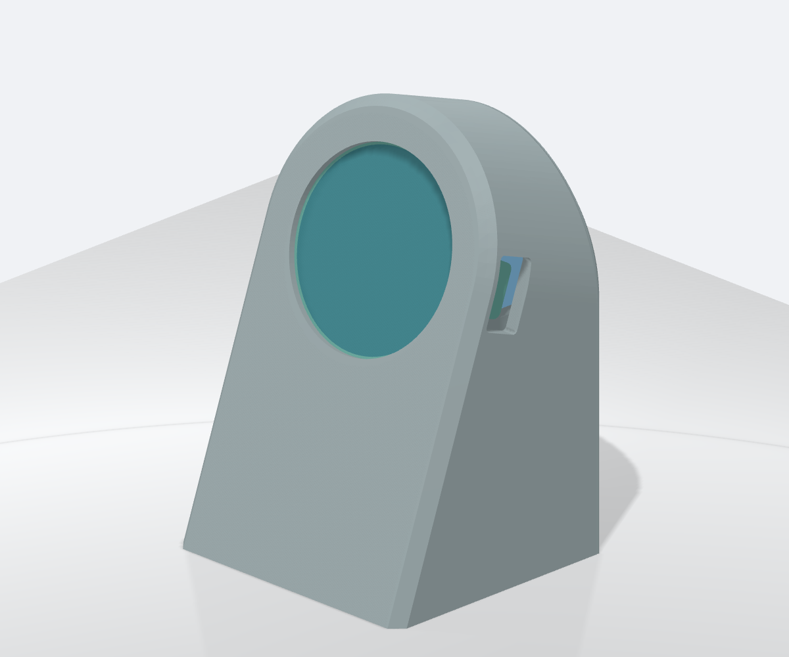

# shottimer

Vibration-triggered espresso shot-timer firmware for Waveshare
**RP2040-LCD-1.28** and **ESP32-S3-Touch-LCD-1.28** boards.
Both use a 240×240 GC9A01 display and QMI8658 IMU.
There is no water-level or pump integration.

## Housing

A printable, screw-free housing is available for the RP2040-LCD-1.28 board and
MakerFocus 2000 mAh battery. See the [housing project](housing/README.md) for
STLs, dimensions, assembly instructions and the parametric CAD build.
[Download the latest housing build](https://github.com/michidk/shottimer/releases/download/housing-latest/housing.zip)
(updated after successful housing builds on `main`).



## Workspace

- `crates/shottimer-core`: timing, motion/orientation, battery estimation, settings.
- `crates/shottimer-app`: shared firmware loop, UI, display and IMU drivers.
- `crates/firmware-rp2040`: RP2040 board backend.
- `crates/firmware-esp32s3`: ESP32-S3 board backend.

Both boards run the same application through embedded-hal drivers and a small
`Platform` interface that separates shared behavior from board-specific hardware.
Dependencies flow from firmware → app → core; firmware can also use core directly.
Shared crates must not depend on MCU HALs. `scripts/verify.sh` checks this boundary.

ESP32-S3 builds successfully but has not been hardware-tested; touch, Wi-Fi, BLE
and PSRAM are not used yet.

## Behavior

- Samples acceleration ten times at 10 ms intervals.
- Detects vibration from the largest per-axis standard deviation.
- Confirms a possible shot after two seconds of continued vibration.
- Updates elapsed time in calibrated 975 ms increments.
- Ends a shot after a timer bucket contains no vibration.
- Corrects the final number and ring to the last detected vibration, excluding
  the quiet stop-confirmation delay. The five-second minimum uses this corrected
  duration; result retention starts when stopping is confirmed.
- Shows the three previous valid shot times below the main number, newest
  first from left to right. Discarded shots are excluded. History survives timer
  resets and mode switches, but clears on reboot. It is shown throughout Timer
  mode, including idle and running shots; set `SHOW_SHOT_HISTORY = false` to hide
  it completely. The current retained result is not repeated in the history row.
- Discards completed shots shorter than five seconds without showing a result.
- Retains the completed value for 60 seconds. New vibration must continue for
  three seconds before replacing it; the new timer then first appears at `3`.
- Resets an active shot at 99 displayed seconds.

Timer mode shows the elapsed value and a two-lap progress arc. The first brown
shade fills over 25 seconds; the second shade overlays it during the next 25
seconds. The arc remains full after 50 seconds while the number continues.

Holding the LCD face-down for 0.5 seconds (`SCREEN_DOWN_HOLD_MS`) arms a mode change. Turning it
back face-up then toggles between Timer and Debug modes. Orientation uses
averaged 100 ms sample windows and accepts a roughly 46° up/down cone. A mode
change resets the shot timer. The hold starts once the filtered direction is down,
so orientation smoothing adds some response time. Set `DEBUG_MODE_ENABLED = false`
to disable Debug mode and the gesture entirely.

At boot, the display first shows solid red, green, and blue for one second each.
Set `COLOR_TEST_ENABLED = false` to skip this test; IMU calibration still runs.
After the color test, a dedicated IMU calibration screen shows live averaged
X/Y/Z acceleration and sample progress. Keep the display still and face-up
during calibration. The strongest gravity axis and its sign become the
screen-up reference; the other two axes are discarded so a small boot-time tilt
cannot redefine the screen plane.

The default configuration then starts in Timer mode. Hold the display face-down
for 0.5 seconds and turn it back up to enter Debug mode.

## Debug mode

Debug mode shows:

- QMI8658 address and cumulative IMU error count since boot (reads, commands, and recovery);
- mean and standard deviation for X/Y/Z acceleration;
- filtered `UP`, `DOWN`, `SIDE`, or `TILTED` screen direction and its numeric
  score (`+1.00` is face-up and `-1.00` is face-down);
- vibration detected (`YES`/`NO`), live deviation, threshold, and rolling peak;
- idle seconds since last activity (`IDLE 42s / 60s`), or timer state and
  remaining confirmation, result-hold, or timeout duration;
- battery voltage, estimated charge, ADC value, and voltage trend when
  `USE_BATTERY = true`;
- IMU initialization or read errors.

RP2040 exposes a USB CDC debug serial port; ESP32-S3 logs through the onboard
CH343 UART bridge at 115200 baud. Both emit X/Y/Z
acceleration, the calibrated screen-normal axis, raw and filtered orientation
scores, and the detected direction twice per second.
Logging can be disabled or its interval changed in the shared settings.
Disabling logging leaves the board's serial interface available.

## Configuration

Settings are compile-time constants in [`crates/shottimer-core/src/settings.rs`](crates/shottimer-core/src/settings.rs).
Edit them, rebuild, and flash the firmware to apply changes.

| Setting | Default | Meaning |
|---|---|---|
| `DEBUG_MODE_ENABLED` | `true` | Allow Debug mode and flip switching; false forces Timer mode even if `START_IN_DEBUG_MODE` is true. |
| `START_IN_DEBUG_MODE` | `false` | Start in Timer mode; `true` selects Debug mode after calibration when enabled. |
| `COLOR_TEST_ENABLED` | `true` | Run the RGB boot test; false skips it without skipping IMU calibration. |
| `SHOW_SHOT_HISTORY` | `true` | Show the three previous valid shot times throughout Timer mode; `false` hides the row in every state. |
| `DISPLAY_ROTATION_DEGREES` | `90` | Clockwise LCD rotation: `0`, `90`, `180`, or `270`. Does not change physical flip detection. |
| `DISPLAY_BRIGHTNESS_PERCENT` | `100` | Backlight PWM duty, `0`–`100`; sleep turns it off and wake restores this level. |
| `SLEEP_ENABLED` | `true` | Allow automatic sleep; false keeps the display and normal sampling active. |
| `SLEEP_TIMEOUT_SECONDS` | `60` | Idle time before sleep. Completed results use their own hold timeout. |
| `SLEEP_WAKE_THRESHOLD_MG` | `50` | Hardware wake-on-motion acceleration change in mg; separate from the running-shot SD threshold. Higher is less sensitive. |
| `SLEEP_CHECK_INTERVAL_MS` | `500` | Periodic interrupt-status/recovery and USB service interval while asleep. Motion can wake earlier. |
| `START_CONFIRM_SECONDS` | `2` | Initial-shot vibration confirmation delay. |
| `CALIBRATION_DURATION_MS` | `3000` | Nominal calibration sampling duration after RGB testing; display updates add overhead. Must be a positive multiple of `SAMPLE_DELAY_MS`. |
| `USB_LOGGING_ENABLED` | `true` | Enable USB CDC (RP2040) or UART (ESP32-S3) diagnostic logs. |
| `SLEEP_DIAGNOSTICS_ENABLED` | `true` | Log sleep decisions, IRQ/motion wake sources, and failures; does not change sleep policy. |
| `ALLOW_SLEEP_WITH_SERIAL_CONNECTED` | `true` | Allow real sleep with a serial terminal attached, overriding USB sleep blocking. Disable to restore the normal USB/debugger policy; independent of logging. |
| `USB_LOG_INTERVAL_MS` | `500` | Positive interval between diagnostic records; `500` means twice per second. |
| `USE_BATTERY` | `true` | Enable battery monitoring and UI; false hides all battery information in both modes and the charging ring. |
| `BATTERY_ADC_REFERENCE_VOLTS` | `3.3` | RP2040 ADC reference voltage in volts; ESP32-S3 uses HAL/eFuse calibration. |
| `BATTERY_VOLTAGE_DIVIDER_RATIO` | `0.5` | RP2040 ADC input/battery ratio; ESP32-S3 uses its own 1/3 divider setting. |
| `VIBRATION_SENSITIVITY_THRESHOLD` | `1.0` | Largest per-axis standard deviation in m/s² required for vibration; higher is less sensitive. |
| `VIBRATION_SD_DEADBAND` | `0.05` | Per-axis SD at or below this noise floor is displayed and treated as zero; `0` disables. Higher values remain unchanged. |
| `MINIMUM_SHOT_SECONDS` | `5` | Discard shorter completed shots. |
| `RESTART_CONFIRM_SECONDS` | `3` | Continuous vibration required to replace a retained result. |
| `SHOT_TIMEOUT_SECONDS` | `99` | Active-shot limit in displayed seconds (975 ms increments). |
| `COMPLETED_SHOT_HOLD_SECONDS` | `60` | Wall-clock seconds to retain a completed result. |
| `PROGRESS_LAP_SECONDS` | `25` | Displayed seconds per ring lap; progress stops after two laps. |
| `SCREEN_VERTICAL_COS_THRESHOLD` | `0.7` | Face-up/down cosine threshold, approximately a 46° cone. Higher narrows the cone. |
| `ORIENTATION_FILTER_ALPHA` | `0.2` | New-reading weight in the orientation filter; lower smooths more and responds slower. |
| `SCREEN_DOWN_HOLD_MS` | `500` | Continuous filtered face-down hold in milliseconds before switching is armed. Turn face-up afterward to switch. |
| `SCREEN_RELEASE_DEBOUNCE_WINDOWS` | `3` | Consecutive face-up windows required to complete switching. |
| `SAMPLE_DELAY_MS` | `10` | Delay between acceleration samples; ten samples form a motion window. |
| `RECENT_PEAK_WINDOWS` | `32` | Number of windows retained by the rolling peak diagnostic. |

For example, with `VIBRATION_SENSITIVITY_THRESHOLD = 1.0`, an SD of
`0.8 m/s²` is quiet, while `1.2 m/s²` counts as vibration. Exactly `1.0 m/s²`
does not trigger detection. Set the threshold above idle noise and below the
running machine's SD readings.

### Low-power sleep

Set `SLEEP_ENABLED = false` to disable automatic sleep. Completed results still
expire after their configured hold duration, returning to the idle Timer screen.

Sleep turns off the backlight and puts the LCD controller into sleep mode.
The accelerometer switches from 1000 Hz to its 128 Hz low-power wake-on-motion
mode; rendering, battery sampling, and regular diagnostic logs pause.
IMU INT2 wakes the MCU, with a timer-based status/recovery check every 500 ms.
RP2040 uses event-based CPU sleep, not dormant mode; clocks and RAM remain
available. ESP32-S3 uses HAL-managed light sleep. Neither resets history.

Movement wakes the screen, but does not itself start a shot: normal sampling
and the existing vibration confirmation rules resume after waking. The flip
gesture is evaluated only after waking; sleeping movement does not toggle modes.
Battery voltage and charging estimates never prevent sleep or wake the board;
the battery is not sampled while asleep. Direct USB host detection normally prevents sleep.
With `ALLOW_SLEEP_WITH_SERIAL_CONNECTED = true`, an attached RP2040 serial terminal
allows real sleep even over USB and does not itself wake the board. Disable this
flag to restore the normal USB/debugger policy. Independently,
`SLEEP_DIAGNOSTICS_ENABLED` enables logs showing
`status`, `enter`, `entered`, periodic `check`, `wake`, `awake`, and any errors,
including IRQ level, IMU motion flag, USB/serial wake causes, SD, and idle time.
Logging and USB servicing add overhead, so serial-connected testing is not
appropriate for measuring power savings.
Actual current savings and wake sensitivity still require testing on the board.

### Charge indicator

With `USE_BATTERY = true`, Timer mode shows a green inner ring and `N%`
when voltage is rising or, on RP2040, a USB host is connected. This battery
indicator does not affect sleep.

Charge is estimated from voltage. Charging state and battery removal cannot be
reliably detected, and current draw is not measured.

### Ring colors

Ring colors use `(red, green, blue)` RGB565 tuples: red/blue `0`–`31`, green
`0`–`63`. Invalid channel values fail at build time. The darker edge shades
soften each arc's pixel boundary.

| Ring setting | Default |
|---|---|
| `RING_FIRST_LAP_COLOR` | `(22, 28, 9)` |
| `RING_FIRST_LAP_EDGE_COLOR` | `(11, 14, 5)` |
| `RING_SECOND_LAP_COLOR` | `(31, 20, 6)` |
| `RING_SECOND_LAP_EDGE_COLOR` | `(16, 10, 3)` |
| `RING_TRACK_COLOR` | `(0, 10, 8)` |
| `RING_TRACK_EDGE_COLOR` | `(0, 5, 4)` |

RP2040 battery voltage is `ADC counts / 4095 × reference volts / divider ratio`.
ESP32-S3 uses the HAL's calibrated ADC millivolts and its 200kΩ/100kΩ divider
(`BATTERY_DIVIDER_RATIO = 1/3` in its hardware module). `METERS_PER_SECOND_SQUARED_PER_COUNT` converts the configured ±8 g IMU
range and should only change together with the sensor range configuration.

RP2040 GPIO and SPI/I2C peripheral assignments are configured in
[`crates/firmware-rp2040/src/hardware.rs`](crates/firmware-rp2040/src/hardware.rs). Edit the `gpN` fields and peripheral
selections, then rebuild. The HAL checks pin reuse and supported SPI/I2C/ADC
assignments at compile time. Changing firmware assignments requires matching
physical wiring; the onboard display and IMU connections are fixed.
The backlight also needs the matching PWM slice and channel in
`select_backlight_pwm!`: GP25 uses slice `pwm4`, `channel_b`. The HAL verifies
that the chosen PWM channel supports the backlight pin.

ESP32-S3 assignments are in
[`crates/firmware-esp32s3/src/hardware.rs`](crates/firmware-esp32s3/src/hardware.rs).
Its LEDC timer/channel are set up in the board entrypoint.

## Build and flash

Use rustup's Cargo/Rust binaries (put `~/.cargo/bin` before any system Rust in
`PATH`). Host checks require no board:

```sh
cargo test --locked
bash scripts/verify.sh
```

### RP2040

```sh
rustup target add thumbv6m-none-eabi
cargo install elf2uf2-rs
cargo rp2040
```

Hold **BOOT** while connecting USB, then flash:

```sh
cargo run --release -p firmware-rp2040 --target thumbv6m-none-eabi
```

ELF: `target/thumbv6m-none-eabi/release/shottimer-rp2040`.
The target runner converts it to UF2 and copies it to the BOOTSEL drive.

### ESP32-S3

Install the [Espressif Rust toolchain](https://docs.espressif.com/projects/rust/book/getting-started/toolchain.html):

```sh
cargo install espup espflash
espup install --targets esp32s3
. ~/export-esp.sh
cargo +esp esp32s3
bash scripts/verify.sh --esp
```

Source the export script in each shell; if a custom export path was used, source
that instead. The `esp` toolchain and `-Zbuild-std=core` are required for Xtensa.

Connect the board over USB and flash via its CH343 serial bridge:

```sh
cargo +esp run --release -p firmware-esp32s3 \
  --target xtensa-esp32s3-none-elf -Zbuild-std=core
```

ELF: `target/xtensa-esp32s3-none-elf/release/shottimer-esp32s3`.
The runner uses `espflash` with ESP32-S3, 16 MB flash, and serial monitoring.
If automatic download fails, hold **BOOT**, press **RESET**, and retry.
Do not flash an RP2040 UF2 onto ESP32-S3.

## Default hardware mapping

Assignments match onboard wiring and require no external vibration sensor.
Changing them requires matching physical wiring.

| Function | RP2040 GPIO | ESP32-S3 GPIO |
|---|---:|---:|
| IMU SDA / SCL | 6 / 7 | 6 / 7 |
| IMU INT2 (sleep wake) | 24 | 3 |
| LCD DC / CS | 8 / 9 | 8 / 9 |
| LCD SCK / MOSI | 10 / 11 | 10 / 11 |
| LCD reset / backlight | 12 / 25 | 12 / 2 |
| Battery voltage ADC | 29 | 1 |
| Debug UART TX / RX | USB CDC | 43 / 44 (TX logging only) |
| Touch reset | — | 13 (touch not implemented) |
| LCD / IMU peripheral | SPI1 / I2C1 | SPI2 / I2C0 |

ESP32-S3 mapping and divider follow the
[Waveshare documentation](https://docs.waveshare.com/ESP32-S3-Touch-LCD-1.28)
and [schematic](https://files.waveshare.com/wiki/ESP32-S3-Touch-LCD-1.28/ESP32-S3-Touch-LCD-1.28-Sch.pdf).

## Acknowledgements and licensing

Shot detection and the circular timer concept were inspired by
[`lspr98/profitec-go-waterlevel-shottimer`](https://github.com/lspr98/profitec-go-waterlevel-shottimer).
This is an independent Rust implementation and contains none of that project's
source code. The referenced repository did not declare a software license when
this acknowledgement was written.

This project is available under either the [Apache License 2.0](LICENSE-APACHE)
or [MIT License](LICENSE-MIT).
