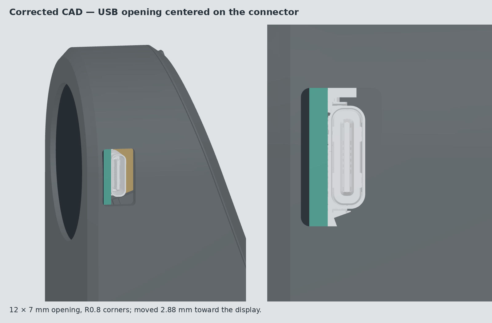
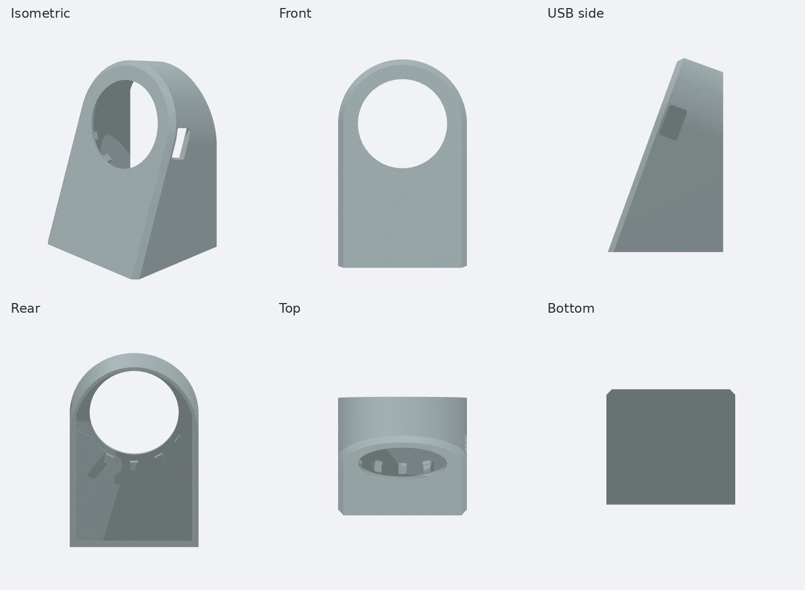

# Shot timer housing

Parametric, screw-free enclosure for the Waveshare **RP2040-LCD-1.28** and a
MakerFocus 3.7 V 2000 mAh LiPo. The display leans back toward the viewer, with
the battery behind it and a removable press-fit rear cover. Compatibility with
the ESP32-S3 board has not been checked.



## Current printable revision

Use **`usb_centered_stand.py`** and **`output/usb-centered/`**.
Earlier scripts and output folders are retained as design history; they are
superseded. [DESIGN.txt](DESIGN.txt) records the iterations.

The build artifact contains exactly these three files:

- `body.stl` — front housing with integrated bezel and floor.
- `cover_print.stl` — rear cover, already oriented for printing.
- `assembly.step` — housing, cover, board and battery.

The latest change moves the USB opening **2.88048 mm toward the display** and
rounds its corners to **R0.8 mm**, retaining its **12 × 7 mm** overall size.
It is centered on the corrected CAD connector, with approximately **1.42 mm**
clearance to the metal shell at both front and rear edges.



## Automated builds and downloads

[Download latest housing artifact](https://nightly.link/michidk/shottimer/workflows/housing.yml/main/housing.zip)
via [nightly.link](https://github.com/oprypin/nightly.link), which resolves the
`housing` artifact from the latest successful `main` workflow run without requiring
GitHub sign-in. The ZIP contains only `body.stl`, `cover_print.stl` and `assembly.step`.

[GitHub build history](https://github.com/michidk/shottimer/actions/workflows/housing.yml?query=branch%3Amain+is%3Asuccess) is the fallback:
open a successful run and download `housing` under **Artifacts** (GitHub sign-in
required). Artifacts are retained for 90 days. For a specific commit, select
its workflow run; the stable artifact name is reused across separate runs.

The [Housing CAD workflow](../.github/workflows/housing.yml) builds housing changes
on `main` and pull requests, and supports manual runs. It checks the full assembly,
sampled insertion paths and USB access before uploading the three files.
There is no release-publishing job and the workflow has read-only repository
permissions. The direct latest-download link uses the third-party nightly.link
service; the actual files remain GitHub Actions artifacts.

Generated `output/` and `dist/` files are ignored by Git. CAD source, the original
board reference and README images are versioned. Fit reports and renders are
produced locally during validation but are not included in the download.
Run `render_docs.py` explicitly to refresh documentation images; CI does not
commit generated images.

## Dimensions and construction

| Parameter | Current value |
| --- | --- |
| Housing width × depth × height | 48 × 45.52 × 72.37 mm |
| Display tilt, back from vertical | 20° |
| Screen opening diameter | 33.2 mm |
| USB opening | 12 × 7 mm, R0.8 corners |
| USB metal nose setback from outer wall | 2.92 mm |
| PCB + display thickness | 1.6 + 2.3 = 3.9 mm |
| Nominal battery length × width × thickness | 50 × 34 × 10 mm |
| Battery allowance, length × width × thickness | 52 × 34.8 × 10.8 mm |
| Battery lean toward rear | 10° |
| Battery pocket and wedge width | 37.2 mm |
| Rear locating rim depth / wall | 3.5 / 1.4 mm |
| Rim clearance | 0.15 mm, with four local friction ribs |

The bottom is integral and flat. Three lower hooks catch the PCB rim, while
curved locator bases share the display recess radius. The rear cover carries
the tilted battery support and a full-width lower pocket lip. Its inner rim has
two battery-corner clearance breaks and four friction ribs; there are no screws
or visible latch holes. A lower fingernail notch helps remove the cover.

## Print and assembly

PLA, 0.2 mm layers, 3 walls, 15% gyroid infill. Print the housing bottom-down
and `cover_print.stl` with its flat outer face on the bed. Inspect the slicer’s
bridges and overhangs around the PCB hooks and cover arms; add local supports
if your printer cannot bridge them reliably. Three walls help the small retainers.

Insert the PCB from the rear: approach tilted back about 12°, slightly raised,
then lower and pivot it beneath the three lower lips. Slide the battery over
the pocket lip and lower it against the angled support. Route its leads clear
of the rim and USB socket before pressing the rear cover into place.

The current USB correction is CAD-checked, not yet verified with another print.
Press-fit tightness still depends on printer calibration. The manufacturer’s
battery listing permits ±2 mm; this pocket uses the user-selected nominal size
plus clearance, so check the actual pack before inserting it.

## Rebuild and render

Run from this directory with Python 3.12. On Linux the renderer also needs an
EGL/OpenGL runtime and DejaVu fonts.

```sh
cd housing                         # from the repository root
uv venv --python 3.12 .venv
uv pip install --python .venv/bin/python -r requirements.txt --override overrides.txt
.venv/bin/python finish_usb_centered.py
```

The override updates PyOpenGL for the NumPy runtime used here. The command
builds the current assembly, validates the changed material and connector
access, exports STL/STEP files, and renders the USB-side and six-view images.
To refresh the README images after rebuilding:

```sh
.venv/bin/python render_docs.py
```

Edit the parameters at the top of `usb_centered_stand.py` for geometry changes.
`finish_usb_centered.py` validates this revision against `curved_holder_stand.py`;
its delta checks rely on the preceding revision’s fit checks. For broader design
changes, run `usb_centered_stand.py` directly for full assembly and sampled
insertion checks. `render_usb_centered.py` renders the installed board and housing.

## Reference model and validation limits

`reference/RP2040-LCD-1.28.step` is the manufacturer board reference.
`assembly_study.import_board()` corrects the simplified stack to the measured
**1.6 mm PCB + 2.3 mm display** and adds a conservative envelope over the
USB-side display connector. The connector envelope reaches the display face;
its lateral outline is approximate. The original STEP is retained unchanged.

The current checks require single valid housing/cover solids and watertight
STLs, check added wall material against components and sampled insertion
motions, and extend the USB metal-shell silhouette through the wall to ensure
it is unobstructed. They do not model the cable overmould, loose wires, battery
mating plug, material flex or every intermediate insertion position. The board
reference also contains a pre-existing invalid component solid; a passing
housing check does not certify every imported component.
